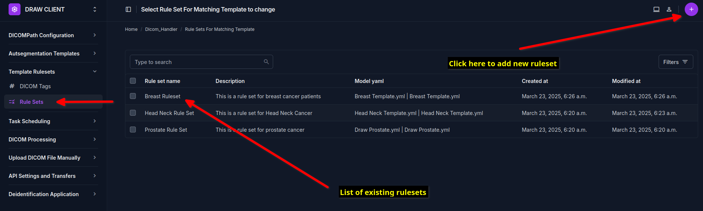
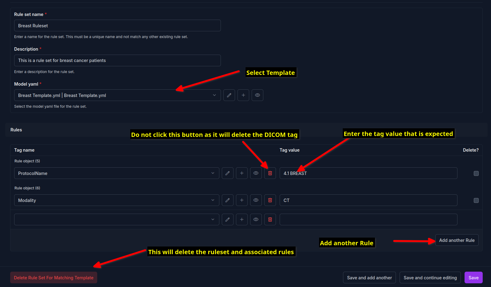
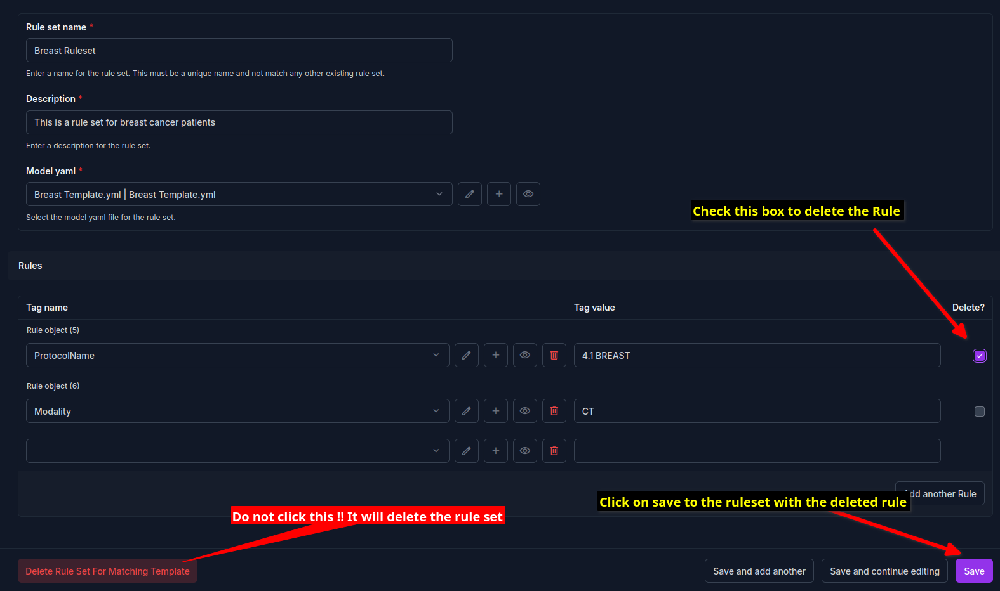

Configure Rules 
=======================================================================

After you have created the autosegmentation templates (see :doc:`creating_autosegmentation_templates`), you need to configure the rules for determining which autosegmentation template to use. This is a required so that the DICOM images are automatically taggeed with the correct autosegmentation template. 

Setup Rulesets
----------------
Rulesets refer to a collection of rules which are used to determine the type of autosegmentation template to use. 
Each rule is a combination of the DICOM tag which will be evaluated and the value of the said tag which will be used to determine the autosegmentation template to use. 
For example, if you have a rule which looks for the DICOM tag "Modality" and the value of the tag is "CT", then the system will evaluate if the DICOM file modality is a CT scan. If so it will use the autosegmentation template which is associated with the CT modality. 
You can create multiple rules for a single ruleset. All of these must be met for the autosegmentation template to be tagged. For example, if you have a ruleset which looks for the DICOM tag "Modality" and the value of the tag is "CT" and another rule which looks for the DICOM tag "PatientPosition" and the value of the tag is "Supine", then the autosegmentation template will only be tagged if both of these conditions are met. 
A autosegmentation template can be associated with a single ruleset only. If you try to associate an autosegmentation template with multiple rulesets, the system will show an error. 

To create a ruleset click on the left side bar menu item called "Template Rulesets" and navigate to the page under the submenu "Rule Sets".

Clicking on the circular button with a plus sign will open a page where a new ruleset can be created. Add the name of the ruleset, and chose a description which tells you later on what this ruleset is for. Then select the autosegmentation template that you want to associate with this ruleset. After that you can add rules below, by selecting the DICOM tag and entering the tag value. If you do not see the desired DICOM tag, search for it using the search bar provided in the dropdown menu.

If you wish to remove a rule from a ruleset, simply check the box at the right and then click on the save button at the bottom of the page.

  
  
Please remember to associate **one ruleset with one autosegmentation template**. The system will not allow you to associate more than one ruleset with an autosegmentation template. However an autosegmentation template that is not associated with any ruleset will not be used for any autosegmentation.

.. note::
   The DRAW client will copy the template that you have selected into the folder of the DICOM dataset before it is sent to the DRAW server for autosegmentation. The template file is available as a YAML file. To improve the security of the system, the code checks the checksum of the YAML file before it is associated with the DICOM dataset. If the checksum does not match, the system will not associate the template with the DICOM dataset. This checksum is calculated when the templates are created using the DRAW client. Thus a YAML file that has been created manually will not be associated with the DICOM dataset. Additionally, if a template is modified after being created using the DRAW client, the checksum will change and the template will not be associated with the DICOM dataset.

