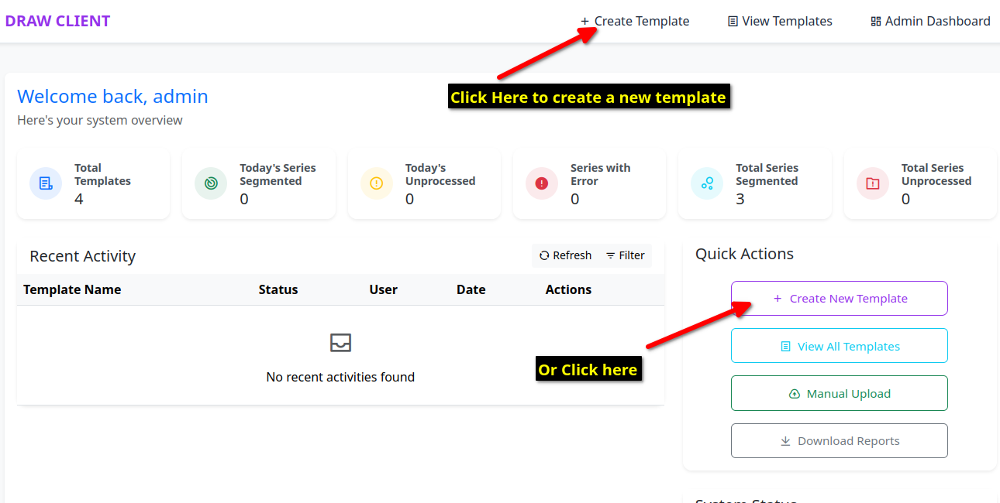

Creating Autosegmentation Templates
====================================

Before the DRAW client can send any DICOM series for autosegmentation, you need to create the autosegmentation templates. We provide a simple interface to create the autosegmentation templates as per your choice. To start either navigate to the home page by clicking on the person icon on the top right corner and choosing the link called "View Site". Alternatively, you can click on the dropdown menu on the top left to open a menu and click on the link called "View Site".

.. image:: images/home_page_link_1.png
   :alt: Home Page
   :width: 300
   :align: center

.. image:: images/home_page_link_3.png
   :alt: Home Page
   :width: 300
   :align: center

After clicking this the main page of the DRAW client will open. If you are using the dockerized version of the DRAW client then navigating to the link http://localhost:8001/ will also take you to the main page.

Clicking on the + Create Templates link will open a new page with a wizard form to create the autosegmentation templates.

The first step will be to enter the name of the template along with a description. Please choose an informative name so that you can easily identify the template later.

.. image:: images/create_template_step_1.png
   :alt: Create Template Step 1
   :width: 800
   :align: center

The next step will be select the structures that you would like to be segmented. Our model repository on the DRAW website is actively linked to this list and your client will reflect all the active models available on the DRAW website. Active models are those models that are currently validated and ready for use.

.. image:: images/create_template_step_2.png
   :alt: Create Template Step 2
   :width: 800
   :align: center

You can search for the structure name (note that the structure names follow the TG263 convention). Additionally if you know the name of the model or the number you can also search by that. Click on the checkboxes to select the structures you would like to be segmented. As you select the structures, the system will show you the list of structures that you have selected.

.. image:: images/create_template_step_3.png
   :alt: Create Template Step 3
   :width: 800
   :align: center

After you click the Create Template button, you will be asked to confirm that you want to create the template and the total number of structures in the template will also be displayed. Clicking the confirm button will create the template.

.. image:: images/create_template_step_4.png
   :alt: Create Template Step 4
   :width: 800
   :align: center

You will finally be shown a representation of the template that has been created. 

You can click on the link called "View Templates" in the top to see all the templates that you have created.

.. image:: images/view_template.png
   :alt: View Templates
   :width: 800
   :align: center

After you have created the template, you can view the contents of the template by clicking on the link in the admin page. A field called Yaml file content will show content of the template that you have created. This can be useful if you wish to show the template to other users in the department as well as for future reference.

.. image:: images/view_template_yaml.png
   :alt: View Template Yaml
   :width: 800
   :align: center

