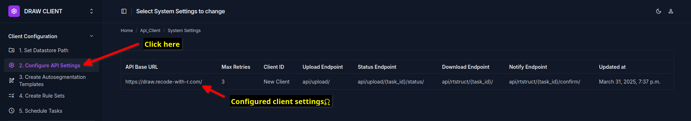

Get API tokens from the DRAW Server
====================================

An API token is required so that the DRAW client can communicate with the DRAW server securely.
When your institute has joined the DRAW project, an account would have been created for you. Pleas use the account credentials to create the API token for the client. 

The steps are as follow:

Obtain API Keys
----------------
Navigate to the DRAW server page (https://draw.chavi.ai/admin/)
You will be able to see a link called Clients on the side bar. 
Click on the Add Client button at the top right corner of the page. This will allow you to create a new client. Note that you cannot delete the client once created. 

Add the name of your institute in the Name field. If you institute will use multiple clients then you add an additional identifier to help understand the location of the client. This can be the name of the site where the client is located. 

Keep the checkbox called "Is Active" checked.

Keep the token expiration date to 30 days as the default.

Clicking on the save button will open a popup with your API tokens.
There are two tokens:   

#. Access Token
#. Refresh Token

The Access Token is used to authenticate the client to the server. The Refresh Token is used to get a new Access Token when the current one expires.

.. image:: images/client_token.png
   :alt: Client Token
   :width: 800
   :align: center

.. note::
    The Aceess token and refresh tokens will be only displayed once. These are not stored by the system so if they have been lost, you will need to save the client again to regenerate the tokens. 

We recommend that you copy the tokens to a text file before entering it into the DRAW client. 

API settings in the Client
--------------------------

In the DRAW client navigate to the page called "Client Settings" under the "API Settings" section (left side bar)
As usual clicking on the circular button with a plus sign will open a window where you can add the API setting.

Please enter the API Base URL as https://draw.chavi.ai/ (the trailing slash is important)

The client ID is the name of client that you created in the previous steps at the DRAW server. Usually this will be the institute name.

Leave the max retries field as 3. 

Next you need to enter the API endpoints. The default values provided should not be changed unless you have been instructed to do so by the DRAW team.

.. image:: images/client_settings2.png
   :alt: Client Settings 2
   :width: 800
   :align: center

Finally the tokens have to be entered. 

.. image:: images/client_settings3.png
   :alt: Client Settings 3
   :width: 800
   :align: center

Please remember to enter the **Access Token** created in the previous steps in the field called **"Bearer Token"**.

Please remember to enter the **Refresh Token** in the field called **"Refresh Token"**.

It is important that you enter the tokens in the correct fields.

The token expiry date will be as shown in the admin interface of the DRAW server which is shown after you have saved the client there. Please enter this value.

After that click the Save button to complete the process.

