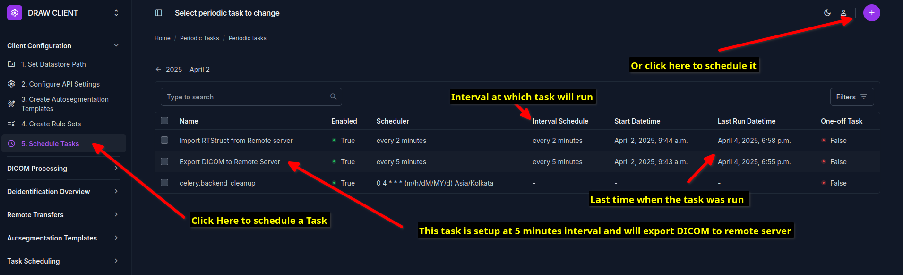
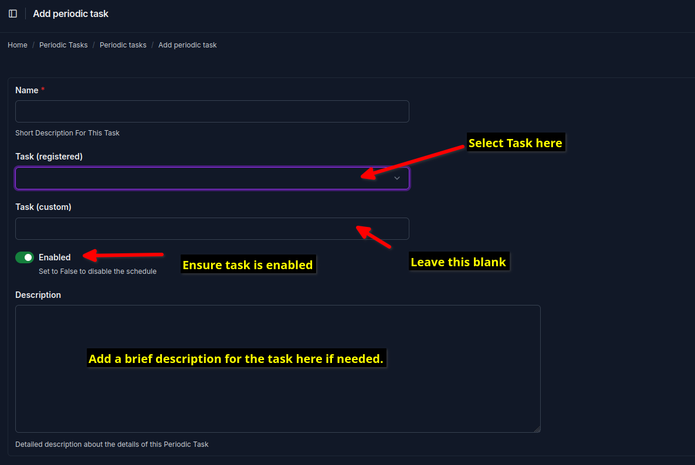
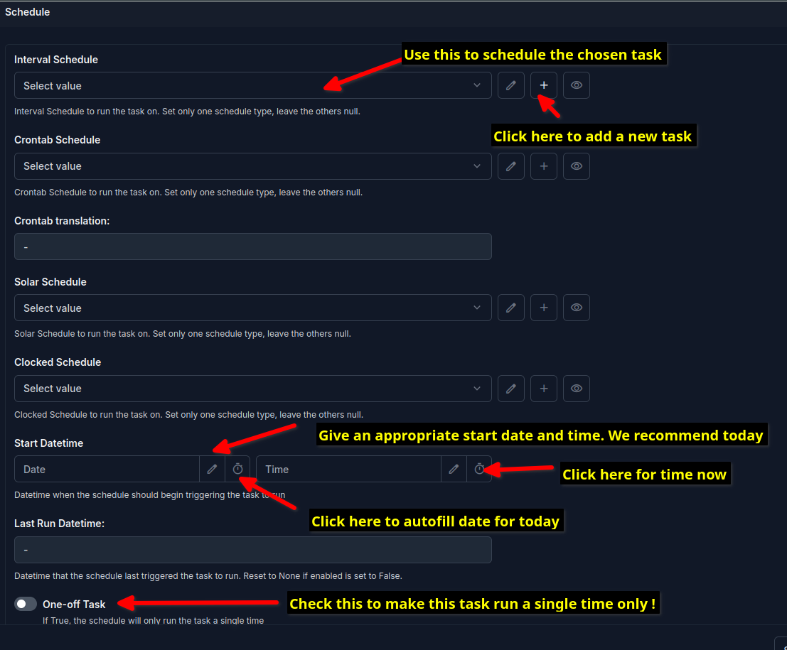
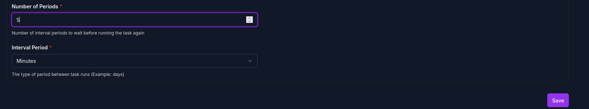

Setup Periodic Tasks
=====================

The periodic tasks are used to schedule the tasks to be executed at specified intervals. The periodic tasks are defined in the DRAW client admin interface. 
The suggested tasks in the table below provide a convinient way to setup the periodic tasks quickly.

The following periodic tasks need to be setup:

Export DICOM to the DRAW Server
--------------------------------

Purpose:
^^^^^^^^^^
This task copies the DICOM files from the datastore to the DRAW server ensuring that each series is copied into its own folder, attaching the autosegmentation template, deidentifying the Data and finally sending the DICOM files to the DRAW server for autosegmentation.

Task name:
^^^^^^^^^^^^
DICOM Export - Pipeline to export DICOM to Remote Server

Suggested interval:
^^^^^^^^^^^^^^^^^^^
10 minutes

Import RTStructureSet from the DRAW Server
------------------------------------------

Purpose:
^^^^^^^^^^
This task polls the DRAW server to check if there are any pending transfers. If there are, it will copy the DICOM RTSTRUCT files from the DRAW server to the datastore. It will reidentify the DICOM RTSTRUCT files and move it back to the datastore folder from where the DICOM data originated.

Task name:
^^^^^^^^^^^^
DICOM Import - Pipeline to import RTSTRUCT from remote server

Suggested interval: 
^^^^^^^^^^^^^^^^^^^
15 minutes

Clean up files and folders
--------------------------

Purpose:
^^^^^^^^^^
This task cleans up the files and folders in the datastore.

Task name:
^^^^^^^^^^^^
api_client.tasks.clean_up_files_and_folders

Suggested interval:  
^^^^^^^^^^^^^^^^^^^
1 day

Note that these recommended intervals are based on the case load at Tata Medical Center. If you are using the DRAW client at a different institution, you may need to adjust the intervals based on the case load at your institution. As a general rule of thumb, these intervals are ok if you have 20 - 25 patients undergoing CT scans per day. If you have a lower case load, then you can increase the intervals for the Notify Server and Poll Server tasks.

How to setup the periodic tasks
--------------------------------

Go to the DRAW client admin interface and click on the menu item called Scheduled Tasks under the Task Scheduling Section. You can see all the scheduled tasks that are currently configured. Clicking on the circular button with the plus sign will allow you to add a new task.

Enter the name of the new task (we suggest giving an informative name) and select the task to be registered from the dropdown menu (see the table above for the task IDs).

Scrolling down further will allow you to configure the schedule. We recommend that you select the Interval Schedule option. If you are doing this for the first time, the dropdown will be empty as no schedules are defined. Click on the + button to add a new schedule. Remember to 

Enter the interval number and select minute, second etc as the time unit and click on the Save button to add a new interval schedule.

Leave the rest of the fields as is and click on the Save button to add the new task.